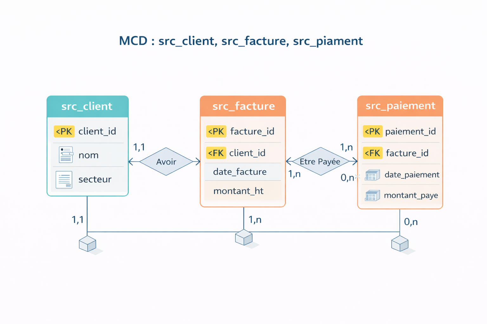

# PROJET SPECIAL E-SI
Présentation lors de l'entretien du vendredi 23/01

🎯 Objectif

Mettre en place une chaîne data complète permettant :

- Intégrer des données métiers brutes (volumineuses et parfois incohérentes)

- Controler la qualité des données

- Construire un data warehouse fiable

-  Fournir à la direction des KPI clairs et exploitables via Power BI.

## Génération des données brutes (Python)

Simuler un environnement réel (données imparfaites)

Script Python génère :
- clients
- factures
- paiements

Introduction volontaire :
- montants négatifs
- paiements incohérents
- factures non payées
- dates invalides


## Chargement des données sources (MySQL – zone source)
Stocker les données telles quelles
Tables typiques :
+ src_client
+ src_facture
+ src_paiement
  
Dans une base de données nommée : `data_plateform`

##  ETL avec Python (Extraction – Transformation – Load)
- Extraction
  
Lecture MySQL / CSV via pandas + SQLAlchemy

- Transformations
  
Normalisation des données

- Load
  
Insertion des données sources dans la base de données `data_plateform` selon les tables

## Contrôles qualité & parité des données

Garantir la fiabilité des chiffres direction

Contrôles réalisés
+ Nullité
+ Unicité
+ Cohérence (montant payé ≤ montant facture)
+ Volumétrie (parité source ↔ staging)

Stockage des résultats : 

- Table dq_metrics
- Historisation des contrôles

## Staging & Data Warehouse (MySQL)
### Staging

- Données nettoyées
- Prêtes à être intégrées

### Data Warehouse

Modélisation en étoile :

- fact_facture
- dim_client
- dim_date

## Calcul des KPI en SQL

KPI calculés:
- kpi_business:
  - CA total
  - CA mensuel
  - CA par secteur
  
- kpi_data_quality:
  - Factures impayées
  - Clients sans paiement récent
    
## Visualisation Power BI (Dashboard Direction)
Power BI → MySQL (tables KPI uniquement)

Visuels clés:
- Carte KPI : CA total
- Bar chart : CA par secteur
- Line chart : évolution mensuelle
- Table : top secteurs
- Slicers : date / secteur

## Processus


## Lancement des codes

### Clone le repertoire sur ton poste de travail
```bash
git clone https://github.com/aigleroyale/projet-E-SI.git
```

### Entrez dans le dossier de travail
```bash
cd projet-E-SI
```

### Créer votre environnement virtuel python et activez le et installer les packages nécessaires
```bash
python -m venv esi_env
```
```bash
esi_env\Scripts\Activate
```
```bash
pip install -r requirement.txt
```

### Générer les données
```bash
python 01_generate_data_raw.py
```

### Créer notre base de données
```sql
------------- Création de la DB
CREATE DATABASE IF NOT EXISTS data_platform
CHARACTER SET utf8mb4
COLLATE utf8mb4_unicode_ci;

USE data_platform;
```
### Créer les tables
```sql
------------ Table src_client
CREATE TABLE src_client (
    client_id INT,
    nom VARCHAR(255),
    secteur VARCHAR(50),
    pays VARCHAR(10),
    date_creation DATE
);

------------ Table src_facture
CREATE TABLE src_facture (
    facture_id INT,
    client_id INT,
    date_facture DATE,
    montant_ht DECIMAL(15,2)
);

------------ Table src_paiement
CREATE TABLE src_paiement (
    paiement_id INT,
    facture_id INT,
    date_paiement DATE,
    montant_paye DECIMAL(15,2)
);
```

## MCD


### Créer les tables

```sql
------------------ INDEX MINIMAUX (PERFORMANCE CHARGEMENT / LECTURE)
CREATE INDEX idx_src_facture_client ON src_facture(client_id);
CREATE INDEX idx_src_facture_date ON src_facture(date_facture);
CREATE INDEX idx_src_paiement_facture ON src_paiement(facture_id);
```

### Vérifiez si les données sont integrées
```bash
----------- REQUÊTES DE VÉRIFICATION MYSQL
SELECT COUNT(*) FROM src_client;
SELECT COUNT(*) FROM src_facture;
SELECT COUNT(*) FROM src_paiement;

SELECT * FROM src_client;
SELECT * FROM src_facture;
SELECT * FROM src_paiement;
```
### Quelques requêtes avancées

```sql
------- Question 1 – Calcule du CA par client sur 12 mois
SELECT c.client_id, c.nom, SUM(f.montant_ht) AS ca_12_mois
FROM src_client c JOIN src_facture f ON f.client_id = c.client_id
WHERE f.date_facture >= DATE_SUB(CURDATE(), INTERVAL 12 MONTH)
GROUP BY c.client_id, c.nom
ORDER BY ca_12_mois DESC;
```

```sql
----- Question 2 – Les factures impayées

SELECT f.facture_id, f.montant_ht, IFNULL(SUM(p.montant_paye), 0) AS montant_paye, f.montant_ht - IFNULL(SUM(p.montant_paye), 0) AS reste_a_payer
FROM src_facture f
LEFT JOIN src_paiement p ON p.facture_id = f.facture_id
GROUP BY f.facture_id, f.montant_ht
HAVING f.montant_ht > IFNULL(SUM(p.montant_paye), 0);


/*SELECT f.facture_id, f.montant_ht, NVL(SUM(p.montant_paye), 0) AS montant_paye, f.montant_ht - NVL(SUM(p.montant_paye), 0) AS reste_a_payer
FROM facture f
LEFT JOIN paiement p ON p.facture_id = f.facture_id
GROUP BY f.facture_id, f.montant_ht
HAVING f.montant_ht > NVL(SUM(p.montant_paye), 0); */
```


```sql
-------- Question 3 – Clients sans paiement depuis 60 jours 

SELECT c.client_id, c.nom
FROM src_client c
WHERE NOT EXISTS (
				  SELECT 1 FROM src_facture f
				  JOIN src_paiement p ON p.facture_id = f.facture_id
                  WHERE f.client_id = c.client_id AND p.date_paiement >= DATE_SUB(CURDATE(), INTERVAL 60 DAY) ); 

/* SELECT c.client_id, c.nom 
	FROM client c 
    WHERE NOT EXISTS ( 
						SELECT 1 
                        FROM facture f 
                        JOIN paiement p ON p.facture_id = f.facture_id 
                        WHERE f.client_id = c.client_id AND p.date_paiement >= SYSDATE - 60 )
;*/ 
```

```sql
-------- Question 4 – Analyse mensuelle (window function)  
SELECT mois, ca_mensuel, LAG(ca_mensuel) OVER (ORDER BY mois) AS ca_mois_precedent
FROM ( SELECT DATE_FORMAT(date_facture, '%Y-%m-01') AS mois, SUM(montant_ht) AS ca_mensuel
		FROM src_facture
		GROUP BY DATE_FORMAT(date_facture, '%Y-%m-01') ) t
		ORDER BY mois; 
```

### TABLES DE QUALITÉ (MySQL)
#### Règles de qualité

```sql
------- Table des règles de qualité
CREATE TABLE dq_rules (
    rule_id INT AUTO_INCREMENT PRIMARY KEY,
    table_name VARCHAR(50),
    rule_name VARCHAR(100),
    description VARCHAR(255),
    seuil DECIMAL(5,2)
);

-------------- Table des métriques de qualité
CREATE TABLE dq_metrics (
    id INT AUTO_INCREMENT PRIMARY KEY,
    table_name VARCHAR(50),
    metric_name VARCHAR(100),
    metric_value DECIMAL(10,2),
    seuil DECIMAL(10,2),
    statut VARCHAR(10),
    date_mesure DATETIME
);
```

```sql
INSERT INTO dq_rules (table_name, rule_name, description, seuil)
VALUES
('src_client', 'client_id_not_null', 'Le client_id ne doit jamais être NULL', 0),
('src_facture', 'montant_ht_not_null', 'Le montant HT doit être renseigné', 0),
('src_facture', 'montant_ht_positive', 'Le montant HT doit être strictement positif', 0),
('src_facture', 'facture_orpheline', 'Facture sans client associé', 0),
('src_paiement', 'montant_paye_positive', 'Le montant payé doit être positif', 0),
('src_facture', 'facture_non_payee', 'Factures non payées (tolérance)',10);
```

```sql
INSERT INTO dq_metrics (
    table_name,
    metric_name,
    metric_value,
    seuil,
    statut,
    date_mesure
)
SELECT
    'src_facture',
    'montant_ht_positive',
    COUNT(*) * 100.0 / (SELECT COUNT(*) FROM src_facture),
    0,
    CASE
        WHEN COUNT(*) = 0 THEN 'OK'
        ELSE 'KO'
    END,
    NOW()
FROM src_facture
WHERE montant_ht <= 0;

```


```sql
----------------- Exemple : contrôle factures non payées
SELECT
    COUNT(*) * 100.0 / (SELECT COUNT(*) FROM src_facture) AS taux_factures_non_payees
FROM src_facture f
LEFT JOIN src_paiement p ON p.facture_id = f.facture_id
WHERE p.facture_id IS NULL;

SELECT
    r.rule_name,
    r.seuil,
    m.metric_value,
    CASE
        WHEN m.metric_value <= r.seuil THEN 'OK'
        ELSE 'KO'
    END AS statut
FROM dq_rules r
JOIN dq_metrics m
  ON r.rule_name = m.metric_name;
```

```sql

----------- Table des rejets
CREATE TABLE dq_rejets_facture (
    facture_id INT,
    client_id INT,
    date_facture DATE,
    montant_ht DECIMAL(15,2),
    motif_rejet VARCHAR(255),
    date_rejet DATETIME
);

INSERT INTO dq_rejets_facture (
    facture_id,
    client_id,
    date_facture,
    montant_ht,
    motif_rejet,
    date_rejet
)
SELECT
    facture_id,
    client_id,
    date_facture,
    montant_ht,
    'Montant HT négatif ou nul',
    NOW()
FROM src_facture
WHERE montant_ht <= 0;

INSERT INTO dq_rejets_facture (
    facture_id,
    client_id,
    date_facture,
    montant_ht,
    motif_rejet,
    date_rejet
)
SELECT
    f.facture_id,
    f.client_id,
    f.date_facture,
    f.montant_ht,
    'Facture sans client associé',
    NOW()
FROM src_facture f
LEFT JOIN src_client c
  ON f.client_id = c.client_id
WHERE c.client_id IS NULL;

INSERT INTO dq_rejets_facture (
    facture_id,
    client_id,
    date_facture,
    montant_ht,
    motif_rejet,
    date_rejet
)
SELECT
    facture_id,
    client_id,
    date_facture,
    montant_ht,
    'Date facture dans le futur',
    NOW()
FROM src_facture
WHERE date_facture > CURDATE();


```


