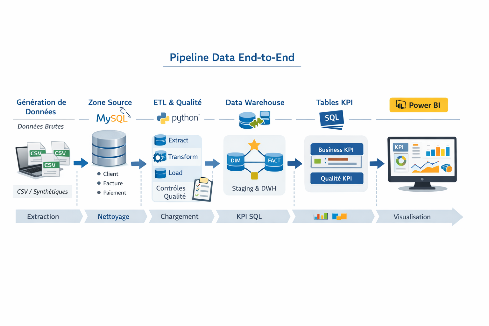

# PROJET SPECIAL E-SI
Présentation lors de l'entretien du vendredi 23/01

🎯 Objectif

Mettre en place une chaîne data complète permettant :

- Intégrer des données métiers brutes (volumineuses et parfois incohérentes)

- Controler la qualité des données

- Construire un data warehouse fiable

-  Fournir à la direction des KPI clairs et exploitables via Power BI.

## Génération des données brutes (Python)

Simuler un environnement réel (données imparfaites)

Script Python génère :
- clients
- factures
- paiements

Introduction volontaire :
- montants négatifs
- paiements incohérents
- factures non payées
- dates invalides


## Chargement des données sources (MySQL – zone source)
Stocker les données telles quelles
Tables typiques :
+ src_client
+ src_facture
+ src_paiement
  
Dans une base de données nommée : `data_plateform`

##  ETL avec Python (Extraction – Transformation – Load)
- Extraction
  
Lecture MySQL / CSV via pandas + SQLAlchemy

- Transformations
  
Normalisation des données

- Load
  
Insertion des données sources dans la base de données `data_plateform` selon les tables

## Contrôles qualité & parité des données

Garantir la fiabilité des chiffres direction

Contrôles réalisés
+ Nullité
+ Unicité
+ Cohérence (montant payé ≤ montant facture)
+ Volumétrie (parité source ↔ staging)

Stockage des résultats : 

- Table dq_metrics
- Historisation des contrôles

## Staging & Data Warehouse (MySQL)
### Staging

- Données nettoyées
- Prêtes à être intégrées

### Data Warehouse

Modélisation en étoile :

- fact_facture
- dim_client
- dim_date

## Calcul des KPI en SQL

KPI calculés:

- CA total
- CA mensuel
- CA par secteur
- Factures impayées
- Clients sans paiement récent

KPI qualité des données:
Tables KPI

- kpi_business
- kpi_data_quality

## Historisation & suivi temporel

KPI stockés par date

Suivi :

- Performance business

- Evolution qualité data

- Prêt pour audit / gouvernance

## Visualisation Power BI (Dashboard Direction)
Power BI → MySQL (tables KPI uniquement)

Visuels clés:
- Carte KPI : CA total
- Bar chart : CA par secteur
- Line chart : évolution mensuelle
- Table : top secteurs
- Slicers : date / secteur

## Processus


## Lancement des codes

### Clone le repertoire sur ton poste de travail
```bash
git clone https://github.com/aigleroyale/projet-E-SI.git
```

### Entrez dans le dossier de travail
```bash
cd projet-E-SI
```

### Créer votre environnement virtuel python et activez le et installer les packages nécessaires
```bash
python -m venv esi_env
```
```bash
esi_env\Scripts\Activate
```
```bash
pip install -r requirement.txt
```

### généré les données
```bash
python 01_generate_data_raw.py
```


